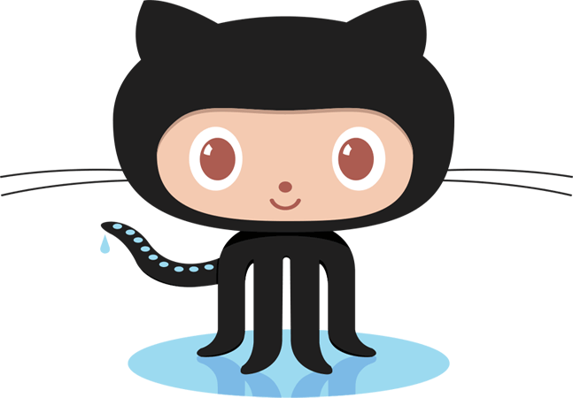

<h1 align="center">Hi there 👋 I'm Michele.</h1>
<h3 align="center">A back-end software engineer from Italy.</h3>

<!-- BANNER -->

👩🏻‍💻 I’m currently working on financial services projects 
🤖 agentic AI enthusiast 
ℹ️ Check my infos at: michelesanfilippo.github.io 
📫 How to reach me michelesanfilippo01@gmail.com

<h3 align="center">Connect with me (clickable)</h3>

 
<!-- BANNER -->

 

<h3 align="center">Languages and Tools:</h3>

  

 
 

  

<!--
**michelesanfilippo/michelesanfilippo** is a ✨ _special_ ✨ repository because its `README.md` (this file) appears on your GitHub profile.

Here are some ideas to get you started:

- 🔭 I’m currently working on ...
- 🌱 I’m currently learning ...
- 👯 I’m looking to collaborate on ...
- 🤔 I’m looking for help with ...
- 💬 Ask me about ...
- 📫 How to reach me: ...
- 😄 Pronouns: ...
- ⚡ Fun fact: ...
-->
